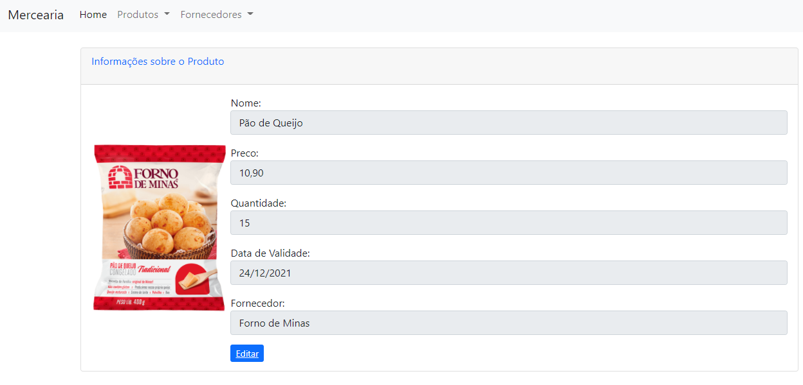

# Controlador de Estoque de Mercearia



> API e Frontend de um Controlador de Estoque para Mercearias. O aplicativo registra produtos e seus fornecedores.

### Ajustes e melhorias

O projeto ainda está em desenvolvimento e as próximas atualizações serão voltadas nas seguintes tarefas:

- [x] CRUD Básico.
- [x] Display de detalhes dos produtos.
- [x] Filtro de produtos assincrono.
- [ ] Limitar o acesso de Criar, Editar, e Deletar apenas administradores.
- [ ] Cadastro de clientes por CPF

## 💻 Pré-requisitos

Antes de começar, verifique se você atendeu aos seguintes requisitos:
<!---Estes são apenas requisitos de exemplo. Adicionar, duplicar ou remover conforme necessário--->
* Java 11
* SpringBoot 2.5.6

## 🚀 Instação

Basta clonar o projeto

## ☕ Usando o projeto

Na pasta principal rodar o seguinte comando

```
./mvnw spring-boot:run
```

Depois é só entrar no seu navegador e acessar:
```
http://localhost:8080/product
```

---
**IMPORTANTE**

É preciso que o projeto rode na porta 8080 do seu computador.

---

## 📝 Licença

Esse projeto foi desenvolvido por [Alex López](https://github.com/lop19029). como parte do programa Starter da  [GFT](https://www.gft.com/br/pt).
